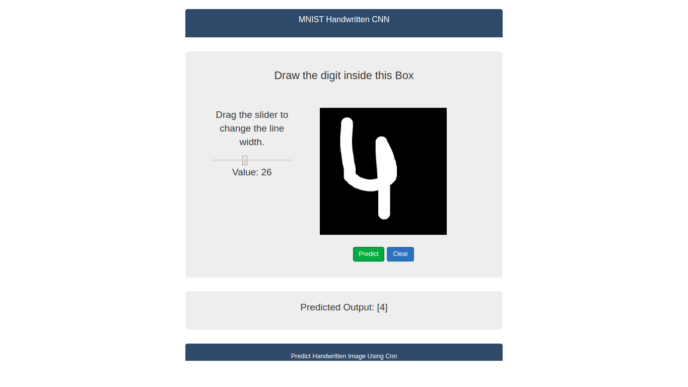

# Classify-Handwritten-Digits-With-Tensorflow
Draw a single digit (0-9) in the box to the left, then click Predict.  A machine learning model trained against the MNIST character dataset will classify the image. Scores for each classification label are plotted below.

